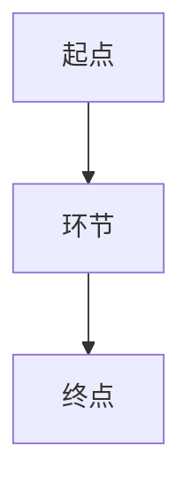
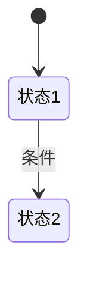

# PRD-SPEC 输出模板

渲染规则（Step6）：
- 文档开头用**元信息表格**（"项 / 内容"两列），不用 blockquote；无对应值填 `—`。
- 固定小节全部保留；不适用的小节保留标题并写"> 本需求不涉及"。
- 来源标注（精简）：默认不标即为已确认；仅对风险项标注 `≈推断`（AI 补全需复核）或 `⚠️待确认`（未定需补齐）；AICoding 资产引用可标 `(ai-kit)` / `(rules)`。
- 流程/状态图用 mermaid，仅用基础语法，不加样式。
- 复用优先：凡 ai-kit 已有能力，在对应功能点内注明"复用 <资产名>"。

---

```markdown
# 【需求名称】PRD-SPEC

| 项 | 内容 |
|------|------|
| 版本 | v0.1 |
| 生成方式 | prd-spec-enhancer |
| 输入类型 | MRD / PRD |
| 知识来源 | AICoding 资产（design/_templates、.cursor/rules、src/ai-kit）/ —（未引用） |
| 待确认项 | N（见文末汇总） |

## A. 需求定位与背景
- **背景与目标**：<...> ≈推断/⚠️待确认（确定则留空）
- **成功指标**：<...> ≈推断/⚠️待确认（确定则留空）
- **目标用户/角色**：<...> ≈推断/⚠️待确认（确定则留空）
- **范围**
  - In-scope：<...>
  - Out-of-scope：<...>

## B. 功能详细说明
### B-1 【功能点名称】（优先级：P0/P1/P2）
- 触发条件：<...>
- 输入：<...>
- 处理逻辑：<...>（复用：<ai-kit 资产名>，如有）
- 输出：<...>
<!-- 按功能点重复 B-n -->

## C. 流程与交互
### C-1 业务流程

### C-2 交互逻辑
- <页面/操作 → 反馈/跳转/状态变化；加载/空/错误态>
### C-3 原型图/页面说明
- <结构化页面描述或图片链接占位>
> 无界面时：本需求不涉及。

## D. 数据与规则
### D-1 字段规则
| 字段 | 类型 | 必填 | 默认值 | 约束/枚举 | 说明 | 来源 |
|------|------|------|--------|-----------|------|------|
| <...> | | | | | | |
### D-2 业务规则/计算逻辑
- <规则/公式/匹配维度> ≈推断/⚠️待确认（确定则留空）
### D-3 状态机


## E. 边界与异常
- **边界条件**：<极值/空值/并发/权限>
- **异常场景与容错**：<失败路径 + 用户提示 + 兜底>
- **兼容性**：<历史数据/老版本/迁移> 或 "本需求不涉及"

## F. 非功能性需求
- **性能**：<响应时间/并发>
- **安全/权限/隐私**：<权限模型/数据保护>
- **埋点/数据统计**：<关键事件与口径>

## G. 交付相关
- **验收标准 / 测试要点**：<每功能点 DoD + 关键用例，可自动验证优先>
- **依赖与约束**：<上下游系统/第三方/排期风险> ≈推断/⚠️待确认（确定则留空）

## R. 复用与规范（AICoding 恒定板块）
- **ai-kit 复用清单**：<逐功能点列出复用的 ai-kit 资产，或注明"无现成资产，需新增"> ⚠️ 无现成资产时给出新增组件建议（可引 design/_templates 流程）
- **规范引用**：<涉及 .cursor/rules 的哪些规则文件>

---

## 待确认项汇总
| # | 所属元素 | 缺什么 | 建议来源 |
|---|----------|--------|----------|
| 1 | <...> | <...> | 输入/业务方/资产检索 |
```
